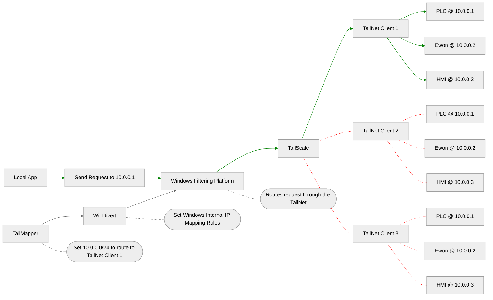
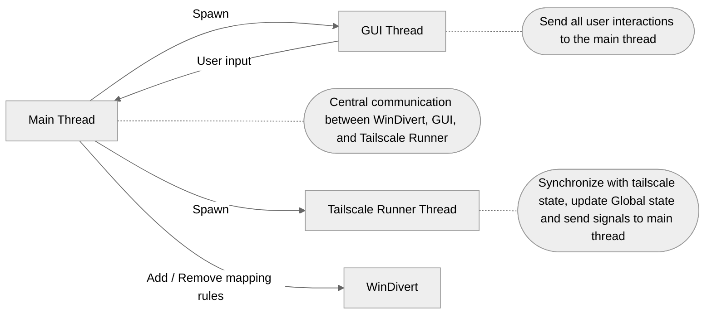

# TailMapper
Map specific remote subnets into your local subnet

## TailMapper.exe
Manage the mappings on your machine

## TailMapperExpose.exe
Manage the exposed mappings on the remote machine

# General Architecture


# Thread Layout
TLDR; The main thread is the communication layer between the GUI, Tailscale Runner, and WinDivert


# Building
```powershell
cmake --build --preset dev
```

# Running
```powershell
./build/tailmapper.exe
```
